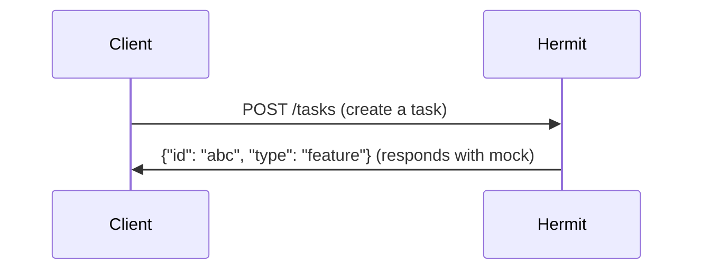

## What should we add?

<!-- Brief summary of the enhancement -->

---

## Problem it solves

<!-- What limitation or pain point does this address? -->

---

## Proposed solution

<!-- How should this work? -->

---

## Why it's valuable

<!-- Why would this improve the project? -->

---

## Usage (if applicable)

<!-- How would users interact with this? Add diagrams if helpful -->

---

## Additional context

<!-- Mockups, screenshots, references, etc. -->

---

/label ~enhancement
