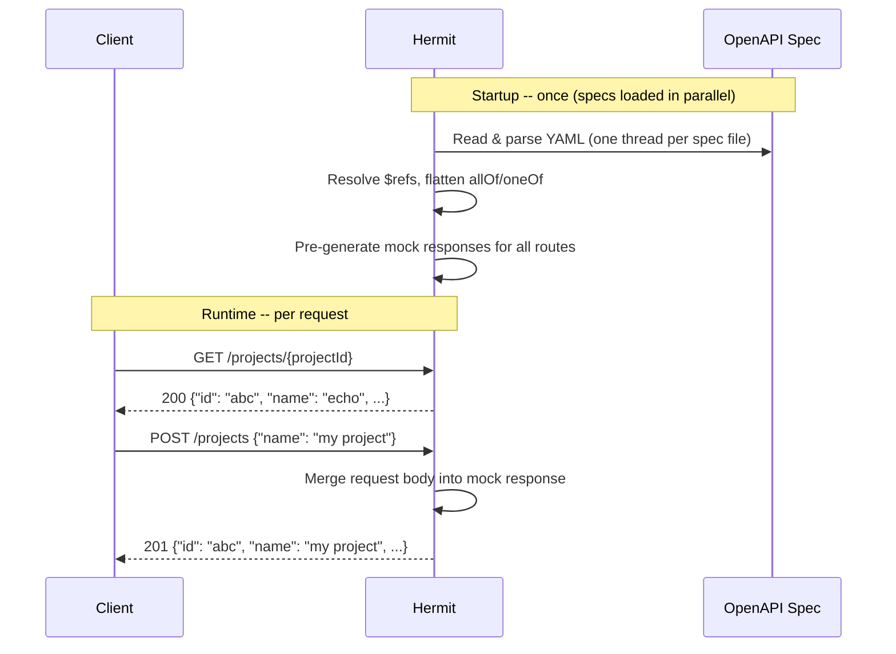

# 🦀🐚 Beavuck Hermit

Hermit is an OpenAPI mock server. Point it at a spec file, and it starts serving lightning-fast
schema-accurate responses out of the box -- no stubs to write, sensible defaults, configurable.

## 📊 Status

[](https://sonarcloud.io/summary/new_code?id=beavuck-services_hermit)

[](https://sonarcloud.io/summary/new_code?id=beavuck-services_hermit)
[](https://sonarcloud.io/summary/new_code?id=beavuck-services_hermit)

[](https://sonarcloud.io/summary/new_code?id=beavuck-services_hermit)
[](https://sonarcloud.io/summary/new_code?id=beavuck-services_hermit)

[](https://sonarcloud.io/summary/new_code?id=beavuck-services_hermit)
[](https://sonarcloud.io/summary/new_code?id=beavuck-services_hermit)
[](https://sonarcloud.io/summary/new_code?id=beavuck-services_hermit)

[](https://sonarcloud.io/summary/new_code?id=beavuck-services_hermit)
[](https://sonarcloud.io/summary/new_code?id=beavuck-services_hermit)

[](https://sonarcloud.io/summary/new_code?id=beavuck-services_hermit)

## 📗 Use cases

Hermit is useful whenever you need an API to be available but don't want to run the real backend:

- **Frontend development** -- build and iterate against real HTTP endpoints without depending on a live backend
- **Integration and E2E testing** -- run tests in CI against a predictable, schema-accurate server with no database or
  external services
- **Contract validation** -- verify that your OpenAPI spec produces the shapes your consumers actually expect

### 🔍 How it works



All schema work (ref resolution, composition, value generation) happens once at startup. Requests are served from an
in-memory map with no I/O.

### 👓 Request body echo

For `POST`, `PUT`, and `PATCH` requests, Hermit merges the fields you send into the mock response. This means your code
sees its own writes reflected back -- the most useful behavior for frontend development:

```bash
# Start Hermit
hermit --specs my-api.openapi.yml other-api.openapi.yml

# Create a project -- the response reflects the name you sent
curl -s -X POST http://localhost:8532/projects \
  -H 'Content-Type: application/json' \
  -d '{"name": "Acme Redesign", "status": "active"}' | jq .
# {
#   "id": "foxtrot",
#   "name": "Acme Redesign",
#   "status": "active",
#   ...
# }
```

### 🧬 Polymorphic responses

When a `POST` endpoint uses `oneOf` with a discriminator, Hermit inspects the request body to pick the right response
shape:

```bash
# Creating a "feature" task returns a FeatureTask shape
curl -s -X POST http://localhost:8532/projects/abc/tasks \
  -H 'Content-Type: application/json' \
  -d '{"type": "feature", "storyPoints": 8}' | jq .type
# "feature"

# Creating a "bug" task returns a BugTask shape
curl -s -X POST http://localhost:8532/projects/abc/tasks \
  -H 'Content-Type: application/json' \
  -d '{"type": "bug", "severity": "high"}' | jq .type
# "bug"
```

### 📄 Response generation

Response field values are resolved in priority order:

| Priority | Source              | When                                                                                 |
|----------|---------------------|--------------------------------------------------------------------------------------|
| 1        | Request body fields | `POST`, `PUT`, `PATCH` -- caller's values win, except for `readOnly` fields          |
| 2        | `example` in schema | Field has an explicit example value (if `--use-examples`)                            |
| 3        | `default` in schema | Field has a default value and no example (if `--use-examples`)                       |
| 4        | Random value        | Fallback -- random word, number, boolean, or format-aware value (UUID, date-time, …) |

Fields marked `readOnly: true` in the schema are never overridden by request body values. Fields marked
`writeOnly: true` are excluded from generated responses entirely.

## 🛠️ Install

See [install.md](docs/install.md).

## 📦 🦀 Install and run from Cargo

See [cargo.md](docs/cargo.md).

## 🐳 Pull from Docker Hub

See [docker.md](docs/docker.md).

## 🚀 Quick start

Run Hermit against your spec (replace the path with your actual spec file):

```bash
hermit --specs ~/Documents/dev/hermit/specs_assets/taskflow.openapi.yml
```

You can point to a directory containing multiple specs to load them all at once -- Hermit merges their routes and loads
them in parallel:

```bash
hermit --specs-dir ~/Documents/dev/hermit/specs_assets
```

To see what arguments are available, run:

```bash
hermit --help
```

Stop the server with `Ctrl+C`, or if it's running in the background:

```bash
kill $(lsof -ti :8532)
```

Replacing the port number at need.

## ⚙️ Options and environment variables

See [options.md](docs/options.md).

## 🔒 Privacy

See [PRIVACY.md](PRIVACY.md).

## 📜 License

See [UNLICENSE](UNLICENSE).

---

_And now some dev stuff_

---

## 🛞 Build and run

Load multiple specs in one command:

```bash
cargo run --release -- --specs-dir specs_assets
```

The server listens on port `8532` by default. Override with `--port`.

To see what arguments are available, run:

```bash
hermit --help
```

## 🔧 Development setup

Install `just`:

```bash
cargo install just
```

Install dev tools:

```bash
just setup
```

In RustRover, go to Settings > Version Control > Commit > Advanced commit checks and choose the `pre-commit`
configuration to run these checks automatically on commit.

Explore `justfile` for available commands.

## ✅ API tests

Requires the server to be running. Run with [Bruno](https://www.usebruno.com/):

```bash
cd api_tests/hermit_api_tests && npx --yes @usebruno/cli run --env hermit_env --reporter-html test_report.html --reporter-json test_report.json
```

## 🐳 Docker

See [docker.dev.md](docs/dev/docker.dev.md).

## 🏗️ Architecture

See [architecture.dev.md](docs/dev/architecture.dev.md).

## 📖 More docs

See [docs/dev](docs/dev)
