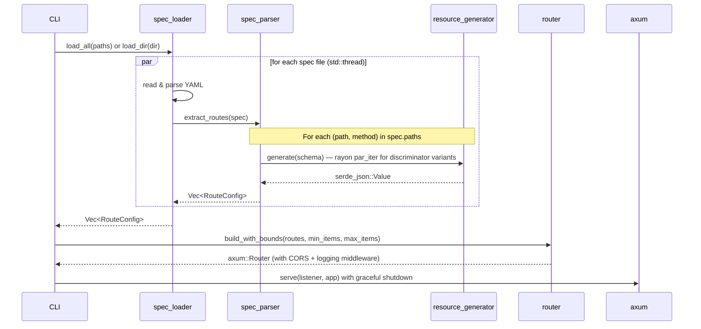
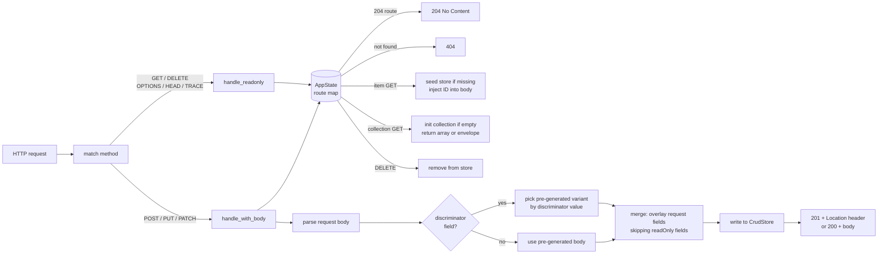

# Architecture

Hermit is a read-once, serve-many mock server. Specs are parsed at startup, responses are pre-generated into memory,
and the server handles requests purely by lookup and merge — no parsing or generation happens at request time (except
for stateful CRUD operations that generate fresh values on demand).

## Module structure

```
src/
  main.rs                Entry point: parses args, wires up the pipeline
  lib.rs                 Declares public modules
  cli.rs                 CLI argument definitions (clap)
  constants.rs           Named constants (default port, bind address, array bounds)
  http_method.rs         Classifies which HTTP methods accept a request body
  spec_loader.rs         Reads spec files from disk and spawns parallel parse threads
  spec_parser.rs         Resolves $refs, flattens schemas, extracts routes, builds item generators
  primitive_generator.rs Generates random primitives (strings, numbers, booleans) respecting format/bounds
  resource_generator.rs  Generates a serde_json::Value from a resolved schema (iterative, not recursive)
  resource_store.rs      In-memory CRUD store (CrudStore), keyed by path
  router.rs              Builds the axum Router; AppState; request handlers
```

## Startup flow

Spec files are loaded in parallel (one OS thread per file). Within each spec, discriminator variants are generated in
parallel via Rayon. Routes from all specs are merged before the server starts.



All schema resolution, `$ref` following, and response generation happens during `extract_routes`. By the time the
server is listening, every route has its response pre-built and its item generator compiled.

## Key data structures

**`RouteConfig`** — the unit produced by spec parsing, one per (path, method):

| Field                 | Purpose                                                                 |
|-----------------------|-------------------------------------------------------------------------|
| `axum_path`           | Axum-style path pattern, e.g. `/items/{id}`                             |
| `method`              | `HttpMethod` enum                                                       |
| `status_code`         | Status from spec (first 2xx found)                                      |
| `body`                | Pre-generated response, or `None` for 204                               |
| `discriminator_field` | Field name that selects a polymorphic variant                           |
| `variants`            | Map of discriminator value → pre-generated body                         |
| `item_generator`      | Closure that generates a fresh item (used when `--use-examples` is off) |
| `read_only_fields`    | Fields the server keeps regardless of client input                      |

**`AppState`** — shared across all requests via `Arc`:

| Field                     | Purpose                                     |
|---------------------------|---------------------------------------------|
| `routes`                  | `HashMap<"METHOD /path", RouteConfig>`      |
| `store`                   | `Arc<RwLock<CrudStore>>`                    |
| `collection_templates`    | Pre-built seed items per collection path    |
| `item_generators`         | Per-path closures for dynamic item creation |
| `min_items` / `max_items` | Collection size bounds                      |

## Concurrency model

| Layer                            | Mechanism                                     | Purpose                              |
|----------------------------------|-----------------------------------------------|--------------------------------------|
| Request handling                 | Tokio async runtime (multi-threaded)          | Concurrent HTTP requests             |
| Spec loading                     | `std::thread::spawn` + `JoinHandle`           | Parallel I/O across spec files       |
| Discriminator variant generation | `rayon::par_iter`                             | CPU-parallel value generation        |
| Shared store                     | `Arc<RwLock<CrudStore>>`                      | Multiple readers / exclusive writers |
| `use_examples` flag              | `AtomicBool` (prod) / `thread_local!` (tests) | Lock-free global flag                |

## Schema resolution

`spec_parser.rs` normalises OpenAPI schemas into a flat `{type, properties}` structure before passing them to the
generator. It also reads `servers[0].url` and prefixes every route with the base path (e.g. a spec with
`url: http://localhost/api/v2` produces routes under `/api/v2/...`). A root URL adds no prefix.


`flatten_schema` is the unforced entry point (GET responses). `flatten_schema_forced(variant)` is used when
pre-generating each discriminator variant for POST/PUT/PATCH.

## Response generation

`resource_generator.rs` walks a flattened schema iteratively using an explicit frame stack — no recursion. This
prevents stack overflows on large or circular specs. A `visiting_refs` counter map enforces a maximum depth of 1 for
circular object references.

Generation priority per schema node:

| Schema condition                           | Output                                                          |
|--------------------------------------------|-----------------------------------------------------------------|
| has `example` (and `--use-examples` on)    | example value, verbatim                                         |
| has `default` (and `--use-examples` on)    | default value, verbatim                                         |
| has `enum`                                 | random pick from enum values                                    |
| `nullable: true`                           | `null` ~30% of the time, otherwise proceeds                     |
| `type: object`                             | object with each non-`writeOnly` property recursively generated |
| `type: object` with `additionalProperties` | named properties plus 1–2 random extra keys                     |
| `type: array` with `items`                 | single-element array from items schema                          |
| `type: array` without `items`              | empty array                                                     |
| `type: string` with `format`               | format-aware value (UUID, date-time, email, URI, …)             |
| `type: string`                             | random words, clamped to `minLength`/`maxLength`                |
| `type: integer` / `number`                 | random integer, bounded by `minimum`/`maximum`                  |
| `type: boolean`                            | random true/false                                               |
| anything else                              | `null`                                                          |

`writeOnly: true` fields are excluded from generated responses. `readOnly: true` fields appear in responses but are
never overwritten by client input.

## Request handling



The route lookup key is `"METHOD /path/{param}"`. Notable behaviours:

- **GET item**: auto-seeds the store on first access, injecting the URL's `{id}` into the response body.
- **GET collection**: initializes with `min_items`–`max_items` seed items on first access. The response is either a
  bare array or an envelope object (when the spec wraps the array in a container object).
- **POST**: generates a fresh ID, stores the merged item, and returns `201 + Location` when no body is in the spec, or
  `200 + body` otherwise.
- **PUT/PATCH**: PATCH reads the existing item first, then merges; PUT replaces from the spec default.

## Discriminator variants

When a POST/PUT/PATCH response schema uses `oneOf`/`anyOf` with an OpenAPI `discriminator`, Hermit pre-generates one
response body per mapping key at startup. At request time it reads the discriminator field from the request body and
serves the matching variant. If the value is absent or unrecognized, it falls back to the first variant.

This means polymorphic APIs (e.g. a task endpoint returning `FeatureTask | BugTask | ChoreTask` based on a `type`
field) work correctly without any per-endpoint configuration.
