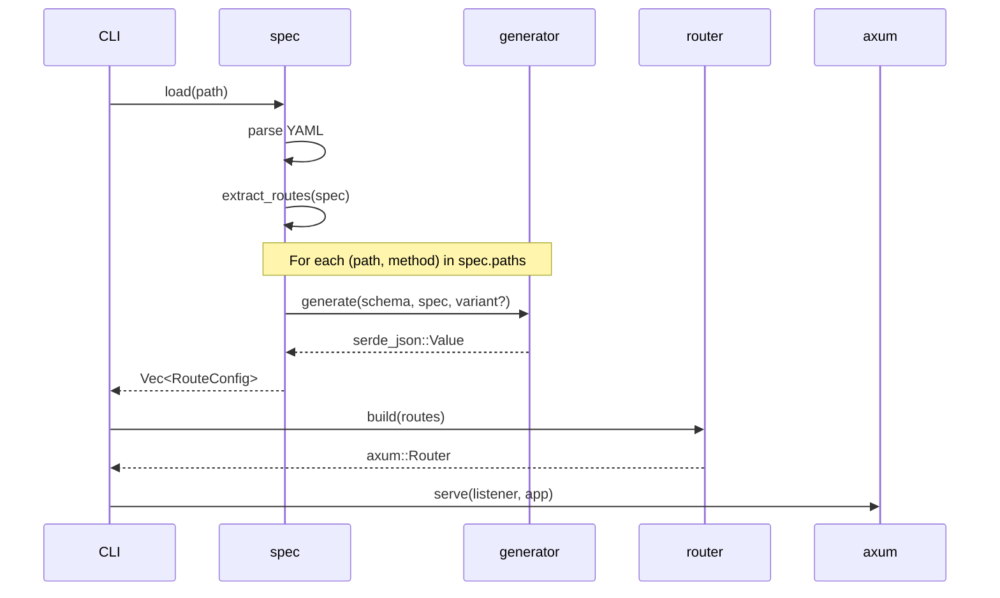
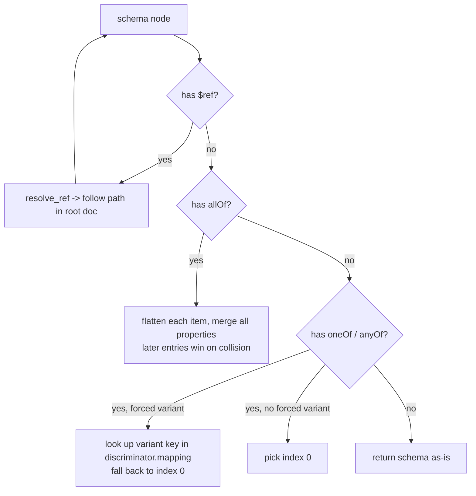
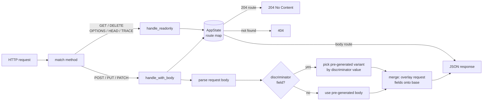

# Architecture

Hermit is a read-once, serve-many mock server. The spec is parsed at startup, all responses are generated eagerly into
memory, and the server then handles requests purely by lookup -- no parsing or generation happens at request time.

## Module structure

```
src/
  main.rs        Entry point: parses args, wires up the pipeline
  cli.rs         CLI argument definitions (clap)
  constants.rs   Named constants (default port, bind address, spec glob)
  spec.rs        Loads the spec, resolves $refs, flattens schemas, extracts routes
  generator.rs   Generates a serde_json::Value from a resolved schema
  http_method.rs Classifies which HTTP methods accept a request body
  router.rs      Builds the axum Router; handles requests
```

## Startup flow



All schema resolution, `$ref` following, and response generation happens during `extract_routes`. By the time the server
is listening, every route has its response pre-built.

## Schema resolution

`spec.rs` normalises OpenAPI schemas into a flat `{type, properties}` structure before passing them to the generator.
The resolution order is:



`flatten_schema` is the unforced entry point (used for GET responses). `flatten_schema_forced(variant)` is used when
pre-generating each discriminator variant for POST/PUT/PATCH routes.

## Response generation

`generator.rs` walks a flattened schema and produces a `serde_json::Value`. Priority order:

| Schema                        | Output                                                |
|-------------------------------|-------------------------------------------------------|
| has `example`                 | the example value, verbatim                           |
| has `enum`                    | random pick from the enum values                      |
| `type: object`                | object with each property recursively generated       |
| `type: array` with `items`    | single-element array from items schema                |
| `type: array` without `items` | empty array                                           |
| `type: string` with `format`  | format-aware random value (UUID, date-time, email, …) |
| `type: string`                | random word                                           |
| `type: integer` / `number`    | random integer in 1–1000                              |
| `type: boolean`               | random true/false                                     |
| anything else                 | `null`                                                |

## Request handling



The route lookup key is `"METHOD /path/{param}"`. For body-accepting methods, the request body is merged on top of the
pre-generated response -- request fields win over spec-derived fields.

## Discriminator variants

When a POST/PUT/PATCH response schema uses `oneOf`/`anyOf` with an OpenAPI `discriminator`, Hermit pre-generates one
response body per mapping key at startup. At request time it reads the discriminator field from the request body and
serves the matching variant. If the value is absent or unrecognized, it falls back to the first variant.

This means polymorphic APIs (e.g. a task endpoint that returns `FeatureTask | BugTask | ChoreTask` depending on the
`type` field) work correctly without any per-endpoint configuration.
